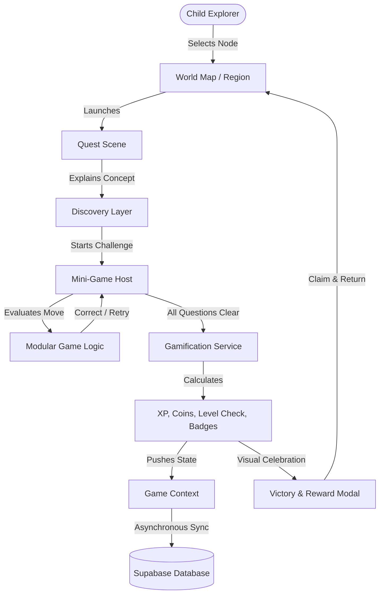

# ARCHITECTURE.md — EduQuest Application Architecture

## 1. System Overview

**EduQuest** is built as a modular Single Page Application (SPA) utilizing React, Vite, React Router DOM, and Supabase for authentication and persistent cloud storage.

The architecture strictly follows a **Game-First Paradigm**:
* The UI is not treated as a series of administrative forms, but as an interactive visual world.
* State transitions mimic game scene changes (e.g. World -> Region -> Quest Briefing -> Mini-Game Scene -> Victory Loot -> World).
* Separation of Concerns: Game Logic, UI Rendering, and Reward Gamification Rules are strictly decoupled.

---

## 2. Directory Structure

```text
d:\dapp\Projects\EduQuest\
├── public/
│   └── assets/                     # Static game sounds, avatars, fallback illustrations
├── src/
│   ├── assets/                     # Packaged SVG icons, logo emblems, illustrations
│   ├── components/
│   │   ├── common/                 # Reusable buttons, cards, dialogs, progress bars, audio toggles
│   │   ├── navigation/             # GameHeader (HUD), BottomNavDock, BreadcrumbPill
│   │   ├── character/              # CharacterStage, WardrobePicker, PoseSelector
│   │   ├── world/                  # WorldMapCanvas, RegionNode, TrailPath, EnvironmentDecor
│   │   ├── quest/                  # QuestCard, StoryIntro, DiscoveryScene, QuestResultModal
│   │   ├── rewards/                # RewardChestModal, LevelUpCelebration, XpToast, CoinCounter
│   │   ├── achievements/           # BadgeGrid, BadgeDetailModal, LockedBadgeModal
│   │   ├── pets/                   # PetDiorama, PetCarousel, FeedAction, HappinessBar
│   │   ├── games/                  # NumberCatcher, PizzaLab, SolarSystem, RobotRescue, StoryBuilder
│   │   └── auth/                   # ProtectedRoute, AuthCard, OAuthButton, MascotSpeech
│   ├── context/
│   │   ├── AuthContext.jsx         # Supabase session, user state, auth methods
│   │   ├── GameContext.jsx         # Active player profile, XP, coins, lives, streaks, inventory
│   │   └── AudioContext.jsx        # Background music, SFX toggle and state
│   ├── hooks/
│   │   ├── useAuth.js              # Access to auth methods and session
│   │   ├── useGame.js              # Access to game state and reward triggers
│   │   ├── useSound.js             # Trigger game SFX (click, correct, levelup, cheer)
│   │   └── useResponsive.js        # Breakpoint and orientation detection
│   ├── lib/
│   │   └── supabase.js             # Supabase client initialization with anon/publishable key
│   ├── data/
│   │   ├── regions.js              # 5 regions configuration and geographic nodes
│   │   ├── quests.js               # Structured quest metadata, storylines, requirements
│   │   ├── games.js                # Mini-game catalogs, questions, algorithms, difficulty sets
│   │   ├── achievements.js         # Badge catalogs, rarity, XP yield, unlock conditions
│   │   ├── items.js                # Outfits, hats, bags, accessories catalogs
│   │   ├── pets.js                 # Companion pet definitions, evolution stages, foods
│   │   └── knowledgeCards.js       # Collectible scientific and historical cards
│   ├── services/
│   │   ├── profileService.js       # Database sync for player profile and stats
│   │   ├── progressService.js      # Database sync for quest and game completion
│   │   └── inventoryService.js     # Database sync for user items, pets, and badges
│   ├── utils/
│   │   ├── gamification.js         # Central deterministic XP, Level, and Streak calculators
│   │   ├── soundEngine.js          # Web Audio API synthesizers and sound effects
│   │   └── storage.js              # LocalStorage fallback & offline persistence helper
│   ├── styles/
│   │   ├── variables.css           # Global design tokens (colors, fonts, shadows, radii)
│   │   └── global.css              # Global resets, typography, safe-area utilities
│   ├── pages/
│   │   ├── Landing.jsx             # Public welcome & onboarding screen (Stitch Screen 0)
│   │   ├── auth/
│   │   │   ├── Login.jsx           # Child/Parent friendly login
│   │   │   ├── Register.jsx        # New adventurer registration
│   │   │   ├── ForgotPassword.jsx  # Password reset request
│   │   │   ├── ResetPassword.jsx   # New password submission
│   │   │   ├── EmailVerification.jsx # Email verification check
│   │   │   └── AuthCallback.jsx    # Supabase OAuth redirect handler
│   │   ├── world/
│   │   │   ├── WorldMap.jsx        # Primary hub (Stitch Screen 1)
│   │   │   └── RegionView.jsx      # Specific region quest board
│   │   ├── quest/
│   │   │   ├── QuestDetail.jsx     # Story briefing and activity overview
│   │   │   ├── DiscoveryView.jsx   # Interactive concept discovery scene
│   │   │   └── QuestResult.jsx     # Quest victory & rewards (Stitch Screen 3)
│   │   ├── games/
│   │   │   └── GameHost.jsx        # Universal mini-game wrapper and state controller
│   │   ├── collection/
│   │   │   └── CollectionView.jsx  # Inventory, cards, and wardrobe browser
│   │   ├── achievements/
│   │   │   └── AchievementsView.jsx # Badges & achievements hall (Stitch Screen 6/7/8)
│   │   ├── character/
│   │   │   └── CharacterCustomizer.jsx # 3D Avatar customizer (Stitch Screen 4)
│   │   ├── profile/
│   │   │   └── ProfileView.jsx     # Adventurer summary & companion status (Stitch Screen 5)
│   │   └── settings/
│   │       └── SettingsView.jsx    # Audio volume, display preferences, account management
│   ├── App.jsx                     # Root router and global context provider wrapper
│   └── main.jsx                    # Vite app entry point
├── .env.example                    # Environment variable template
├── package.json
└── vite.config.js
```

---

## 3. Core Application Routing

All routing is managed through `react-router-dom` (v6/v7).

### 3.1 Route Hierarchy

```text
/ (Public Landing / Welcome screen)
│
├── /auth/login                       [Public]
├── /auth/register                    [Public]
├── /auth/forgot-password             [Public]
├── /auth/reset-password              [Public]
├── /auth/verify-email                [Public]
├── /auth/callback                    [Public - OAuth redirection]
│
└── [Protected Routes]                (Requires Authenticated User)
    ├── /world                        (World Map Main Hub)
    ├── /world/:regionId              (Region Quest Nodes)
    ├── /quest/:questId               (Quest Story & Challenge)
    ├── /discovery/:discoveryId       (Interactive Concept Exploration)
    ├── /game/:gameId                 (Mini-Game Host)
    ├── /quest/:questId/result        (Victory & Rewards)
    ├── /daily-quests                 (Daily Challenges & Daily Chest)
    ├── /rewards                      (Active Rewards Claim Screen)
    ├── /collection                   (Inventory & Knowledge Cards)
    ├── /pets                         (Pet Companions & Care)
    ├── /achievements                 (Badge Trophy Room)
    ├── /character                    (Raka Character Customizer)
    ├── /profile                      (Player Explorer Pass)
    └── /settings                     (Sound & Account Options)
```

Unauthenticated requests to any protected route automatically preserve the attempted destination in state and redirect to `/auth/login`.

---

## 4. State Management Strategy

To maintain simplicity, high performance, and avoid boilerplate or external state libraries (e.g. Redux), state is compartmentalized into **three focused React Contexts**:

### 4.1 AuthContext
* Manages the Supabase user session (`supabase.auth.getSession()`).
* Listens to auth changes via `supabase.auth.onAuthStateChange()`.
* Exposes `user`, `session`, `loading`, `error`, `signUp()`, `signInWithPassword()`, `signInWithGoogle()`, `signOut()`, and `resetPassword()`.

### 4.2 GameContext
* Manages current player profile, live vitals, and inventory:
  - `profile`: `{ id, username, level, xp, coins, lives, streak, avatar_id }`
  - `equippedGear`: `{ hat, outfit, backpack, shoes, pet }`
  - `unlockedItems`: List of item IDs
  - `questProgress`: Map of quest completion and scores
  - `achievements`: List of unlocked badge IDs
* Central reward dispatch method:
  `awardReward({ xp, coins, badgeId, itemId, questId })`
  This triggers deterministic calculations, updates local state instantly for zero-latency UI feedback, and persists the payload asynchronously to Supabase PostgreSQL.

### 4.3 AudioContext
* Manages ambient background adventure music and tactile sound effects using lightweight Web Audio API synthesis or preloaded audio clips.
* Respects user preference ("Musik ON" / "Musik OFF"), persists state across sessions.

---

## 5. Game Architecture & Data Flow



### 5.1 Game Host Abstraction
Every mini-game (Number Catcher, Pizza Lab, Solar System Builder, Robot Rescue, Story Builder) implements a standard interface:
* Inputs: `gameConfig` (title, subject, difficulty, questions/tasks), `onSuccess`, `onTryAgain`, `onComplete`.
* Outputs: Standardized event payload (`score`, `accuracy`, `timeSpent`, `mistakesCount`).
* Independent Rendering: Each mini-game renders its own interactive scene without knowing about the database or auth layer.

---

## 6. Supabase Integration Layer

* **Client:** `@supabase/supabase-js` initialized strictly with client-safe environment variables:
  - `VITE_SUPABASE_URL`
  - `VITE_SUPABASE_PUBLISHABLE_KEY`
* **Offline Resiliency:** If Supabase connection is offline or environment variables are in demo mode during development, the service layer transparently falls back to an in-memory / LocalStorage mock player profile, allowing seamless testing without crashing.
* **Row-Level Security (RLS):** Policies are enforced at the PostgreSQL database level so that each authenticated user can strictly only read and write their own player rows.
