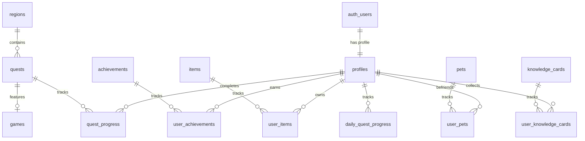

# DATABASE.md — EduQuest Supabase PostgreSQL Schema

This document details the PostgreSQL database schema for EduQuest hosted on Supabase, complete with tables, relationships, indexes, constraints, and Row-Level Security (RLS) policies.

---

## 1. Schema Architecture & Entity Relationship Overview

EduQuest utilizes two distinct categories of tables:
1. **Public Catalog Tables (Read-Only to Players):** Pre-seeded educational content (regions, quests, mini-games, achievement definitions, pet species, wardrobe items, knowledge cards).
2. **Player State Tables (Protected by User ID):** User progress, inventory, pet bonds, quest completion, and stats.



---

## 2. Table Definitions & SQL DDL

### 2.1 `profiles`
Linked 1:1 with Supabase `auth.users.id`. Stores player identity, progression vitals, and streak records.

```sql
CREATE TABLE public.profiles (
    id UUID PRIMARY KEY REFERENCES auth.users(id) ON DELETE CASCADE,
    username TEXT NOT NULL,
    avatar_id TEXT DEFAULT 'raka_classic',
    level INTEGER NOT NULL DEFAULT 1 CHECK (level >= 1),
    xp INTEGER NOT NULL DEFAULT 0 CHECK (xp >= 0),
    coins INTEGER NOT NULL DEFAULT 100 CHECK (coins >= 0),
    lives INTEGER NOT NULL DEFAULT 3 CHECK (lives >= 0 AND lives <= 5),
    streak INTEGER NOT NULL DEFAULT 1 CHECK (streak >= 0),
    last_active_at TIMESTAMPTZ DEFAULT timezone('utc'::text, now()),
    created_at TIMESTAMPTZ DEFAULT timezone('utc'::text, now()) NOT NULL,
    updated_at TIMESTAMPTZ DEFAULT timezone('utc'::text, now()) NOT NULL
);
```

### 2.2 `regions`
The 5 grand educational zones on the World Map.

```sql
CREATE TABLE public.regions (
    id TEXT PRIMARY KEY, -- e.g. 'lembah-angka', 'hutan-sains'
    name TEXT NOT NULL,
    subject TEXT NOT NULL, -- 'Matematika', 'Sains', 'Bahasa', 'Logika', 'Umum'
    description TEXT NOT NULL,
    required_level INTEGER NOT NULL DEFAULT 1,
    order_index INTEGER NOT NULL,
    is_active BOOLEAN NOT NULL DEFAULT true,
    illustration_url TEXT,
    created_at TIMESTAMPTZ DEFAULT timezone('utc'::text, now()) NOT NULL
);
```

### 2.3 `quests`
Specific adventure story challenges within a region.

```sql
CREATE TABLE public.quests (
    id TEXT PRIMARY KEY, -- e.g. 'perkalian-kilat-01'
    region_id TEXT NOT NULL REFERENCES public.regions(id) ON DELETE CASCADE,
    title TEXT NOT NULL,
    story_intro TEXT NOT NULL,
    discovery_id TEXT,
    game_id TEXT NOT NULL,
    xp_reward INTEGER NOT NULL DEFAULT 120,
    coins_reward INTEGER NOT NULL DEFAULT 40,
    order_index INTEGER NOT NULL,
    created_at TIMESTAMPTZ DEFAULT timezone('utc'::text, now()) NOT NULL
);
```

### 2.4 `quest_progress`
Tracks the completion status, star rating, and score of quests per player.

```sql
CREATE TABLE public.quest_progress (
    id UUID PRIMARY KEY DEFAULT gen_random_uuid(),
    user_id UUID NOT NULL REFERENCES public.profiles(id) ON DELETE CASCADE,
    quest_id TEXT NOT NULL REFERENCES public.quests(id) ON DELETE CASCADE,
    status TEXT NOT NULL DEFAULT 'completed' CHECK (status IN ('started', 'completed')),
    score INTEGER NOT NULL DEFAULT 0,
    stars INTEGER NOT NULL DEFAULT 3 CHECK (stars >= 1 AND stars <= 3),
    completed_at TIMESTAMPTZ DEFAULT timezone('utc'::text, now()) NOT NULL,
    UNIQUE(user_id, quest_id)
);
```

### 2.5 `achievements` & `user_achievements`
Prestige badges and trophies awarded for milestones.

```sql
CREATE TABLE public.achievements (
    id TEXT PRIMARY KEY,
    title TEXT NOT NULL,
    description TEXT NOT NULL,
    category TEXT NOT NULL CHECK (category IN ('angka', 'sains', 'kata', 'eksplorasi')),
    icon TEXT NOT NULL,
    xp_reward INTEGER NOT NULL DEFAULT 50,
    created_at TIMESTAMPTZ DEFAULT timezone('utc'::text, now()) NOT NULL
);

CREATE TABLE public.user_achievements (
    id UUID PRIMARY KEY DEFAULT gen_random_uuid(),
    user_id UUID NOT NULL REFERENCES public.profiles(id) ON DELETE CASCADE,
    achievement_id TEXT NOT NULL REFERENCES public.achievements(id) ON DELETE CASCADE,
    unlocked_at TIMESTAMPTZ DEFAULT timezone('utc'::text, now()) NOT NULL,
    UNIQUE(user_id, achievement_id)
);
```

### 2.6 `items` & `user_items`
Wearable character wardrobe items (hats, outfits, backpacks, shoes).

```sql
CREATE TABLE public.items (
    id TEXT PRIMARY KEY,
    name TEXT NOT NULL,
    category TEXT NOT NULL CHECK (category IN ('hat', 'outfit', 'backpack', 'shoes', 'accessory')),
    rarity TEXT NOT NULL DEFAULT 'common' CHECK (rarity IN ('common', 'rare', 'epic', 'legendary')),
    icon_url TEXT NOT NULL,
    unlock_level INTEGER DEFAULT 1,
    cost_coins INTEGER DEFAULT 0,
    created_at TIMESTAMPTZ DEFAULT timezone('utc'::text, now()) NOT NULL
);

CREATE TABLE public.user_items (
    id UUID PRIMARY KEY DEFAULT gen_random_uuid(),
    user_id UUID NOT NULL REFERENCES public.profiles(id) ON DELETE CASCADE,
    item_id TEXT NOT NULL REFERENCES public.items(id) ON DELETE CASCADE,
    is_equipped BOOLEAN NOT NULL DEFAULT false,
    acquired_at TIMESTAMPTZ DEFAULT timezone('utc'::text, now()) NOT NULL,
    UNIQUE(user_id, item_id)
);
```

### 2.7 `pets` & `user_pets`
Collectible animal companions with growth levels and happiness meters.

```sql
CREATE TABLE public.pets (
    id TEXT PRIMARY KEY, -- e.g. 'lumi-fox', 'bubu-panda'
    name TEXT NOT NULL,
    species TEXT NOT NULL,
    description TEXT NOT NULL,
    unlock_level INTEGER NOT NULL DEFAULT 1,
    habitat_image TEXT NOT NULL,
    avatar_image TEXT NOT NULL,
    created_at TIMESTAMPTZ DEFAULT timezone('utc'::text, now()) NOT NULL
);

CREATE TABLE public.user_pets (
    id UUID PRIMARY KEY DEFAULT gen_random_uuid(),
    user_id UUID NOT NULL REFERENCES public.profiles(id) ON DELETE CASCADE,
    pet_id TEXT NOT NULL REFERENCES public.pets(id) ON DELETE CASCADE,
    level INTEGER NOT NULL DEFAULT 1,
    xp INTEGER NOT NULL DEFAULT 0,
    happiness INTEGER NOT NULL DEFAULT 100 CHECK (happiness >= 0 AND happiness <= 100),
    is_active BOOLEAN NOT NULL DEFAULT false,
    acquired_at TIMESTAMPTZ DEFAULT timezone('utc'::text, now()) NOT NULL,
    UNIQUE(user_id, pet_id)
);
```

### 2.8 `daily_quests` & `daily_quest_progress`
Recurring 24-hour adventure challenges that unlock the Daily Chest.

```sql
CREATE TABLE public.daily_quests (
    id TEXT PRIMARY KEY,
    title TEXT NOT NULL,
    target_count INTEGER NOT NULL DEFAULT 1,
    xp_reward INTEGER NOT NULL DEFAULT 100,
    coins_reward INTEGER NOT NULL DEFAULT 30,
    icon TEXT NOT NULL
);

CREATE TABLE public.daily_quest_progress (
    id UUID PRIMARY KEY DEFAULT gen_random_uuid(),
    user_id UUID NOT NULL REFERENCES public.profiles(id) ON DELETE CASCADE,
    daily_quest_id TEXT NOT NULL REFERENCES public.daily_quests(id) ON DELETE CASCADE,
    current_count INTEGER NOT NULL DEFAULT 0,
    is_completed BOOLEAN NOT NULL DEFAULT false,
    date DATE NOT NULL DEFAULT CURRENT_DATE,
    UNIQUE(user_id, daily_quest_id, date)
);
```

---

## 3. Indexes for Performance

```sql
CREATE INDEX idx_profiles_xp ON public.profiles(xp DESC);
CREATE INDEX idx_quest_progress_user ON public.quest_progress(user_id);
CREATE INDEX idx_user_achievements_user ON public.user_achievements(user_id);
CREATE INDEX idx_user_items_user ON public.user_items(user_id);
CREATE INDEX idx_user_pets_user ON public.user_pets(user_id);
CREATE INDEX idx_daily_quest_progress_user_date ON public.daily_quest_progress(user_id, date);
```

---

## 4. Row-Level Security (RLS) Policies

All tables have RLS enabled:
```sql
ALTER TABLE public.profiles ENABLE ROW LEVEL SECURITY;
ALTER TABLE public.regions ENABLE ROW LEVEL SECURITY;
ALTER TABLE public.quests ENABLE ROW LEVEL SECURITY;
ALTER TABLE public.quest_progress ENABLE ROW LEVEL SECURITY;
ALTER TABLE public.achievements ENABLE ROW LEVEL SECURITY;
ALTER TABLE public.user_achievements ENABLE ROW LEVEL SECURITY;
ALTER TABLE public.items ENABLE ROW LEVEL SECURITY;
ALTER TABLE public.user_items ENABLE ROW LEVEL SECURITY;
ALTER TABLE public.pets ENABLE ROW LEVEL SECURITY;
ALTER TABLE public.user_pets ENABLE ROW LEVEL SECURITY;
ALTER TABLE public.daily_quests ENABLE ROW LEVEL SECURITY;
ALTER TABLE public.daily_quest_progress ENABLE ROW LEVEL SECURITY;
```

### 4.1 Public Catalog Policies (Read-Only to All Authenticated Users)
```sql
CREATE POLICY "Public catalogs are viewable by all users" ON public.regions FOR SELECT USING (true);
CREATE POLICY "Quests are viewable by all users" ON public.quests FOR SELECT USING (true);
CREATE POLICY "Achievements are viewable by all users" ON public.achievements FOR SELECT USING (true);
CREATE POLICY "Items are viewable by all users" ON public.items FOR SELECT USING (true);
CREATE POLICY "Pets are viewable by all users" ON public.pets FOR SELECT USING (true);
CREATE POLICY "Daily quests are viewable by all users" ON public.daily_quests FOR SELECT USING (true);
```

### 4.2 User Specific Data Policies (Strict Isolation)
```sql
-- Profiles
CREATE POLICY "Users can read own profile" ON public.profiles FOR SELECT USING (auth.uid() = id);
CREATE POLICY "Users can insert own profile" ON public.profiles FOR INSERT WITH CHECK (auth.uid() = id);
CREATE POLICY "Users can update own profile" ON public.profiles FOR UPDATE USING (auth.uid() = id);

-- Quest Progress
CREATE POLICY "Users can manage own quest progress" ON public.quest_progress FOR ALL USING (auth.uid() = user_id);

-- User Achievements
CREATE POLICY "Users can manage own achievements" ON public.user_achievements FOR ALL USING (auth.uid() = user_id);

-- User Items
CREATE POLICY "Users can manage own inventory items" ON public.user_items FOR ALL USING (auth.uid() = user_id);

-- User Pets
CREATE POLICY "Users can manage own companion pets" ON public.user_pets FOR ALL USING (auth.uid() = user_id);

-- Daily Quest Progress
CREATE POLICY "Users can manage own daily quest progress" ON public.daily_quest_progress FOR ALL USING (auth.uid() = user_id);
```
